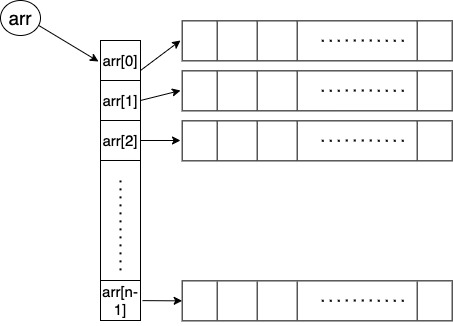
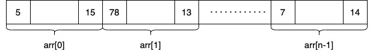

# 16-ти ноември 2023г.

# Псевдоними/Референции
Референциите са алтернативни имена за вече съществуващи променливи. Правейки промени по референцията, се променя и оригиналната променлива. 
## Синтаксис
```
<тип>& <име> = <променлива>;
```
! Не можем да оставим референцията без първоначална стойност!  
Пример:
```
int a = 5;
int &b = a;

std::cout << "a=" << a << std::endl; // a=5
std::cout << "b=" << b << std::endl; // b=5

b++;
std::cout << "a=" << a << std::endl; // a=6
std::cout << "b=" << b << std::endl; // b=6

a++;
std::cout << "a=" << a << std::endl; // a=7
std::cout << "b=" << b << std::endl; // b=7
```

## Сравнение на референция и указател
### Указател
```
int a = 5;
int *ptr_a = &a;
```
`ptr_a` e указател към `а`. В него се пази 16-тично число, представляващо адреса, на който се намира променливата `а`
```
std::cout << ptr_a << std::endl;
// 0x7ff7b9430132  
```
Всякакви директни промени по променливата `ptr_a` се отразяват само върху адресът, който се пази в нея, но не и върху променливата, която сочи - `a`
```
std::cout << ptr_a + 2 << std::endl;
// 0x7ff7b9430134  

std::cout << a << std::endl;
// 5  
```
Стойността на оригиналната променлива `a` може да се достигне използвайки операторa `*` за дерефириране (различаваме `int* ptr` от `*ptr`. В първия случай звездата показва, че дефинираме променлива от тип указател, докато във втория е оператор, благодарение на който достъпваме стойността в клетката, сочена от `ptr`).
```
std::cout << (*ptr_a) + 2 << std::endl;
// 7

*ptr_a = 10; 
std::cout << a << std::endl;
// 10  
```

Указателите се третират като отделни променливи от компилатор със собствени стойности (адресите в паметта) и собствено пространство в паметта. Могат да получат стойност по подразбиране, ако не са инициализирани.

Използват се при:
- достъп до динамично заделена памет на хийпа
- полиморфизъм (следващия семестър повече подробности)
- възможност някакъв обект въобще да не съществува
- за избягване от копирането на големи обекти (като масиви)
- и други

### Псевдоними
```
int a = 5;
int& ref_a = a;
```
Псевдонимите директно се свързват с променливата, която им е присвоена. Всяка промяна на псевдонима директно се отразява върху променливата и обратно
```
cout << ref_a << endl; 
// 5
ref_a++;
cout << a << endl;
// 5
```
Тъй като псевдонимите се свързват с друга променлива, трябва задължително да ги инициализираме при създаването им.


Отново правим разлика между двете употреби на `&` - `int& ref = b` и `&ref`. В първия случай се дефинира референция, а във втория се ичползва оператор `&``, който ще върне адреса на последвалата промнелива. 

## Подаване на фактическите параметри на функция
### Подаване по стойност
```
void swap(int a, int b) {
    int temp = a;
    a = b;
    b = temp;
}

int main() {
    int aa = 5, bb = 7;
    swap(aа, bb);
    cout << aa << " " << bb << endl;
    // 5 7
}
```
При извикването на функцията, във формалните параметри се копират  стойностите на фактическите, т.е. при извикването swap(aa, bb) в тялото на функцията се случва следното: 
`swap(int a = aa, int b = bb){ ... }`

Следователнно промени направени по формалните параметрите в тялото на функцията няма да се отразят на фактическите параметри.
### Подаване по указател
```
void swap(int* a, int* b) {
    int temp = *a;
    *a = *b;
    *b = temp;
}

int main() {
    int aa = 5, bb = 7;
    int ptr_aa = &a, ptr_bb = &b
    swap(ptr_aa, ptr_bb);
    cout << aa << " " << bb << endl;
    // 7 5
}
```
При извикването на функцията в този случай отново във формалните параметри се копират стойностите на фактическите параметри. Случва се:
`swap(int* a = ptr_aa, int* b = ptr_b) {...}`

Тъй като този път параметрите са от тип указател, всички промени, които се направят по стойността, сочена от указателя, ще се отразят на фактическите параметри. В случая в swap, тъй като дереференцираме - `*а` и `*b`, ще променим и стойностите на `aa` и `bb` от main. **НО** всички промени по указателя няма да се отразят на фактическите параметри от main. В примера отдолу можем да видим, че дори и да преместим указателя с едно напред в nextAddress, в main функцията след извикването на nextAddress той ще проължи да си сочи оригиналната стойност - първия елемент на масива.

```
void nextAddress(int* a) {
    a++;
    cout << a << endl;
    // 6 -> втория елемент в масива
}

int main() {
    int arr[] = {5, 6};
    cout << *arr << endl;
    // 5 -> първия елемент в масива
    nextAddress(arr);
    cout << *arr << endl;
    // 5 -> отново първия елемент в масива
}
```

### Подаване по референция
```
void swap(int& a, int& b) {
    int temp = a;
    a = b;
    b = temp;
}

int main() {
    int aa = 5, bb = 7;
    swap(aа, bb);
    cout << aa << " " << bb << endl;
    // 7 5
}
```
Формалните параметри тук са референции и при извикванет на функцията тези референции се свързват с формалните параметри, т.е. променливите  `aa` и `bb` от main. Това, което се случва е:
`swap(int& a = aa, int& b = bb){ ... }` и всички промени, които се направят в тялото на функцията ще се отразят на фактическите параметри `aa` и `bb`.


# Многомерни масиви
## Двумерни масиви
Това са едномерни масиви, чиито елементи са също едномерни масиви с еднаква дължина.  
```
<тип> <име>[<брой едномерни масиви>][<размер на едномерните масиви>];
```
При употреба най-честно третираме двумерните масиви като таблици, в които има толкова редове, колкото едномерни масив имаме, и толкова колони, колкото е размера на тези едномерни масиви. Следователно горния запис е еквивалентен на :
```
<тип> <име>[<брой редове>][<брой колони>];
```

### Представяне в паметта
Двумерният масив е съставен от указатели към първите елементи на масивите, които съдържа, както може да се види на изображението долу:


Всички стоности са подредени последователно в паметта. 

### Синтаксис
```
int arr1[3][4]; // създава се матрица с 3 реда и 4 колони

int arr2[3][4] = { { 1, 2, 3, 4 }, { 9, 8, 7, 6 }, { 11, 12, 13, 14 } }; // изреждаме редовете

int arr3[3][4] = { 1, 2, 3, 4, 9, 8, 7, 6, 11, 12, 13, 14 }; // еквивалентно на горния вариант

int arr4[][4] = { 1, 2, 3, 4, 9, 8, 7, 6, 11, 12, 13, 14 }; // можем да изпуснем най-левия размер
```
### Подаване на фунцкия
```
const int M = 4;
void func(int arr[][M], int n, int m) {
    for(int i = 0; i < n; i++) {
        for(int j = 0; j < m; j++) {
            //правим нещо с arr[i][j];
        }
    }
}
```
Както при дефиницията можем да изпуснем най-левия размер, но всички останали трябва да бъдат декларирани.

# Задачи
## Псевдоними и указатели
Какво ще изведат сегментите код:
### 1. задача
```
int main(){
    int a = 5;
    int& ref = a;
    
    a /= 2;
    cout << ref << endl;
}
```
### 2. задача
```
void func(int arr[], int n) {
    for(int i = 1; i < n; i += 2) {
        arr += 2;
        cout << *(arr) << " ";
    }
    cout << endl;
}
int main(){
    int arr[5] = {1,2,3,4,5};

    func(arr, 5);

    cout << *(arr + 2) << endl;
}
```
### 3. задача
```
int main(){
    int a = 5;
    int* ptr1 = &a;
    int** ptr2 = &ptr1;

    cout << ptr2 << endl;
    cout << *ptr2 << endl;
    cout << **ptr2 << endl;
    
}
```
### 4. задача
```
int main(){
    int arr[5] = {1,2,3,4,5};
    int* ptr = arr;
    int*& ref = ptr;

    ref++;
    cout << *ptr << endl;

    int** ptr2 = &ref;
    cout << *(*ptr2 + 2) << endl;
}
```


## Двумерни масиви/матрици
### 1. задача
По въведена матрица изведете транспонираната й. Пробвайте първо с квадратна матрица и след това с правоъгълна.  
Пример:
```
1  2  5  87  435
23 39 65 90  500
45 50 70 124 555
67 73 80 200 600
```
Транспонираната:
```
1   23  45  67
2   39  50  73
5   65  70  80
87  90  124 200
435 500 555 600
```
### 2. задача
Сортирайте двумерен масив, така че елементите във всички колони и редове да да подредени в нарастващ ред.  
Пример за сортиран двумерен масив:
```
1  2  5  87  435
23 39 65 90  500
45 50 70 124 555
67 73 80 200 600
```
### 3. задача
По въведена матрица, запишете минималния елемент от всеки ред в отделен масив.

### 4. задача
По въведена квадратна матрица с цели числа, определете дали образува магически квадрат, т.е. дали сумата от елементите по всяка колона, по всеки ред и по двата диагнала е равна.  
Примери:
```
2	16	13	3
11	5	8	10
7	9	12	6
14	4	1	15

4	9	2
3	5	7
8	1	6

1	23	16	4	21
15	14	7	18	11
24	17	13	9	2
20	8	19	12	6
5	3	10	22	25
```
### 5. задача
Проверете дали сред 8 кралици поставени върху шахматна дъска 8x8, има поне две, които се бият.
Две кралици сe бият, ако за един ход едната може да стигне до позицията на другата, т.е. двете кралици се намират на един ред, колона или диагонал.

